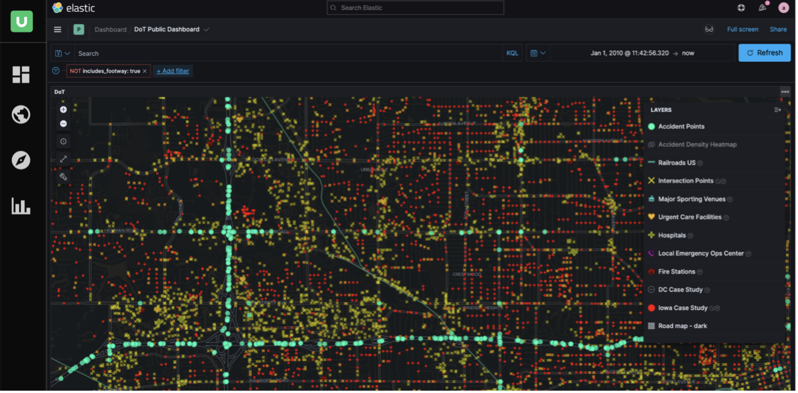
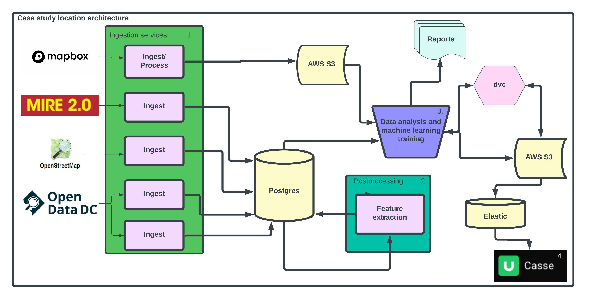
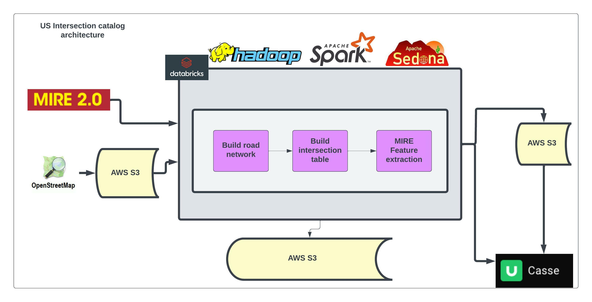

# Department of Transportation: Roadway Safety

This repository contains services for instantiating Roadway Safety services. It contains application data, data, and deployment code for key services. The data ingestion, preparation, and curation is split into two separate pipelines, the [case study](#requirements) pipeline and the [nationwide inventory](# US Inventory pipeline) pipeline.

## Visualization

To interact with the data produced using this pipeline in a visual user interface one can go to https://casse.ugroup.io/#/event-risk/traffic-analysis.




## Overview
The repository is divided into four sections:

```
.
├── data                        # Data for services
├── devsecops                   # Deployment code for services
│   └── local                   # Local deployment code
├── documentation               # Human-readable project documentation
│   └── Technical Overview.docx # High-level technical overview
└── services                    # Application  code for services
|__ experiments                 # Jupyter notebooks and AI modeling code
|   |___ case_study_modeling    # Crash severity model
```


# Case Study Location Pipeline



The project's microservices architecture allows services to be captured in separate folders and will be independently deployable, both locally and in the cloud. For a complete overview, see the [documentation](documentation) folder's [technical overview](technical_overview.docx).

### Requirements

Be sure you are using at least docker compose version 2+, and docker engineer version 20. You will also need python 3.7 or up. Python installation instructions are available here for [Windows](https://docs.python-guide.org/starting/install3/win/) and [Mac](https://docs.python-guide.org/starting/install3/osx/).

## Section 2: Starting and Stopping

Before starting the case study service for the first time, you will need to set the proper environment variables, pull the necessary datasets, and set the proper configurations.

### Setting environment variables
In order to use dvc to fetch raw input data files set the following environment variables with your AWS IAM credentials that have proper read permissions to the dvc repository. Depending on how your aws cli is configured, this step may be optional.

    export AWS_ACCESS_KEY_ID="<access_key>"
    export AWS_SECRET_ACCESS_KEY="<secret_key>"

On Windows, instead of export use 'set'; the syntax is otherwise identical.

### Prepare necessary raw data with dvc
For first time setup install dvc with

    pip install "dvc[s3]"

After setting the environment variables necessary to read from the dvc repo, use:

    dvc pull -r develop

to pull the data/ directory and all of its contents from the remote location labeled "develop". 

#### If dvc changes are needed
This directory contains raw input files as well as processing ingestion scripts. The S3 bucket location is set in .dvc/config and can be updated with

    dvc remote add <remote_name> <s3_uri>

The entire data/ folder is version controlled by dvc, and any updates to this folder can be managed by

    dvc add data
    git add data.dvc
    git commit -m "Dvc update"
    git push origin <branch>
    dvc push -r public

For more information on adjusting the dvc remote repo or committing updates with dvc see [dvc](https://dvc.org/doc/start/data-management).

### Setting configurations

The pipeline will attempt to ingest data in each subfolder of the 'data' folder into its own schema. By default, Iowa is ignored.
In order to enable or disable processing for case study locations, adjust the contents of

    /data/ignore.txt
	
To add a region to the ignore list, add a new line modeled on the following, replacing "iowa" with the name of the region to exclude:
	
	/data/iowa/

To remove a region from the ignore list, simply remove its corresponding line from the file. Note that the names must match the folder name for the region precisely.

## Credentials
### Database Credentials
Stub database credentials are located in the devsecops/local/env folder. It is recommended for security to change the details of these documents prior to running the pipeline. There are three database env documents: db_root_user, db_builder, and db_reader. These are used for admin access, builder access, and read_only access, respectively.

### Mapbox Credentials
The Mapbox environment file mapbox.env includes database credentials and a Mapbox token; the default token will not work, but a token can be generated after signing up for free at [Mapbox's site](https://account.mapbox.com/auth/signup). After signing up, visit the [token tab](https://account.mapbox.com/access-tokens/) and click 'Create a Token'. Be aware that after 50,000 requests, you may be charged.

Unlike the other steps in the pipeline, satellite image generation requires a Mapbox token. This process will crash unless the token is provided.

## Running the case study pipeline via docker-compose
To build and start the services in this template:

1. Open a command line interface session.
2. Change directories to the folder that contains this [README](README.md) file.
3. Run this command:
    ```
    docker-compose -f devsecops/local/docker-compose.yml up --force-recreate --build
    ```

To stop the services in this template:

1. Open a command line interface session.
2. Change directories to the folder that contains this [README](README.md) file.
3. Run this command:
    ```
    docker-compose -f devsecops/local/docker-compose.yml down -v
    ```
    * NOTE: The `-v` flag will remove all persistent data.

This will create a virtual network to house all microservices to ingest, process, and store the data.

### Accessing the data via local SQL client
With the docker service running, launch your local SQL client. Create a PostgreSQL connection, and input your credentials. The username and password are available in an env file in devsecops/local/env; you can use the prebuilt or (recommended) change the env file before running the pipeline and use the new credentials.

# US Inventory pipeline



The US Inventory pipeline runs on Databricks. This requires setting up a Databricks cluster on S3. All code associated with this pipeline is located in
    /databricks
with documentation in the databricks folder's [README](/databricks/README.md).

# Case study experiments

The case study datasets are prime for detailed analysis. Some initial analytic scripts are stored in the experiments/ directory. See the experiments [README](experiments/README.md) for more details.
