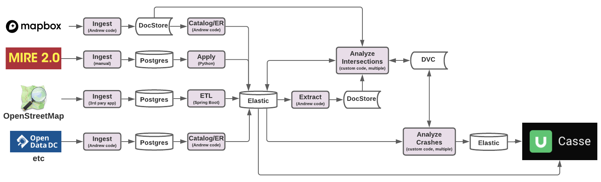

# Department of Transportation: Roadway Safety

This repository contains services for instantiating Roadway Safety services. It contains application data, data, and deployment code for key services. The project's microservices architecture allows services to be captured in separate folders and will be independently deployable, both locally and in the cloud. For a complete overview, see the [documentation](documentation) folder's [technical overview](technical_overview.docx).

## Requirements:

Be sure you are using at least docker compose version 2+, and docker engineer version 20.



If you have trouble reading this document, paste its contents into an online Markdown editor like [Dillinger](https://www.dillinger.io/).

## Section 1: Overview

The repository is divided into four sections:

```
.
├── data                        # Data for services
├── devsecops                   # Deployment code for services
│   └── local                   # Local deployment code
├── documentation               # Human-readable project documentation
│   └── Technical Overview.docx # High-level technical overview
└── services                    # Application  code for services
```

## Section 2: Starting and Stopping (Locally)

To build and start the services in this template:

1. Open a command line interface session.
2. Change directories to the folder that contains this [README](README.md) file.
3. Run this command:
    ```
    docker-compose -f devsecops/local/docker-compose.yml up --force-recreate --build
    ```

To stop the services in this template:

1. Open a command line interface session.
2. Change directories to the folder that contains this [README](README.md) file.
3. Run this command:
    ```
    docker-compose -f devsecops/local/docker-compose.yml down -v
    ```
    * NOTE: The `-v` flag will remove all persistent data.

## Section 3: Adding a New Region

1. Create a new subfolder under data by copying the template folder. Rename this folder to the region you wish to ingest.
2. The region folder should have 5 subfolders: aadt, crashes, osm, postprocess, and preingest.
3. Drag and drop your data into the corresponding folder (traffic volume into aadt, osm data into osm, etc.)
   3.1. Currently only geojson and csv are supported for aadt and crashes.
   3.2. You can customize ingestion by adding a bash script in the appropriate folder to run instead of normal ingestion.
4. If there are any sql prerequisites (such as creating a table to house the data) that should be run before ingestion, add them to the preingest folder.
5. If there is any sql postprocessing (such as renaming headers or creating indices) that should be run after ingestion, add them to the preingest folder. 
   5.1. Note that OSM ingestion is run in a separate process after crashes and aadt are ingested, and the "postprocess" scripts in the data folder will thus be run *before* the osm data is ingested.

To disable a region, update the ignore.txt file under the data folder. Add a new line matching the pattern "/data/{region_name}/". These regions will be skipped during ingestion.

## Section 4: TODOs (Incomplete)

1. Standardize OSM devsecops practices, including deployment documentation.
2. Incorporate Logstash to accelerate data pipelines.
3. Develop cloud deployment standards.
4. Incorporate DVC.
5. Incorporate existing Mapbox data ingestion processes.
6. Incorporate extra crash data sources.
7. Enable data science analyses.
8. Extend CASSE/visualization capability.
