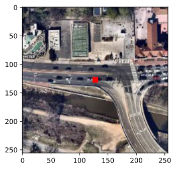
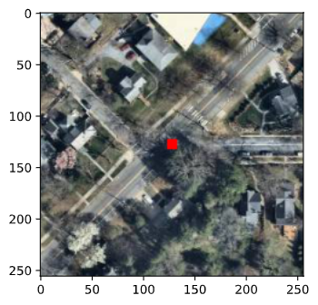
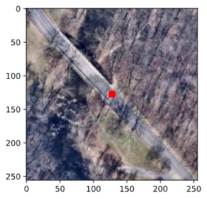

At-Grade Intersection/Junctions
===============================

.. contents:: **Contents:**
    :depth: 2
    :local:

110: Unique Junction Identifier
-------------------------------

This is an implementation detail that isn't intrinsic to the intersection itself.
Data coming from OpenStreetMaps (OSM) already has unique IDs. 

✓ 111: Type of Intersection/Junction
-------------------------------------

.. note:: **From the model inventory:**

    Recommended Attributes:

    1. Roadway/roadway (not interchange related)
    2. Roadway/roadway (interchange ramp terminal)
    3. Roadway/pedestrian crossing (e.g., midblock crossing, pedestrian path or trail)
    4. Roadway/bicycle path or trail
    5. Roadway/railroad grade crossing
    6. Other

OSM data labels nodes, ways, and relations with key/value pairs. 
The `"highway" <https://wiki.openstreetmap.org/wiki/Key:highway>`_ tag "identifies
any kind of road, street, or path." We can leverage these keys to derive element 111.

The following examples were pulled from our in-development system, selecting for specific 
intersection types:

    Roadway/roadway (interchange ramp terminal)

    Roadway/roadway (not interchange related)

    Roadway/bicycle path or trail

.. note:: **Key Question**

    Can intersections be labeled with multiple types? 
    For instance, can a Roadway/roadway intersection also be a Roadway/trail?

112 -- 114: Location Identifiers
--------------------------------

From OSM data, we can easily extract latitude/longitude coordinates of intersections.
Further, we can extract the names and route numbers of roadways meeting at an intersection. 

Using mile-markers along routes to identify intersections would not be possible with OSM data.

✓ 115: Intersection/Junction Number of Legs
-------------------------------------------

We are currently modeling the number of legs as adjacent edges to a node in a roadway network graph.
The results aren't yet reliable. 

.. note:: **Key Question**
    
    We could use more detail on the definiton. 

    "The number of legs entering an at-grade intersection/junction."

    Specifically, what constitutes a "leg"? 

✓ 116: Intersection/Junction Geometry
-------------------------------------

"The type of geometric configuration that best describes the intersection/junction."

.. note:: **Key Question**

    This element is marked as FDE, or Fundamental Data Element. Is this information already 
    well captured by reported state data? Or is the information hard to come by?

We plan to model this element. It is not, to our knowledge, captured in any approximate form in OSM data.
However, overhead images can be used to classify intersections into types. This is a classic machine learning
problem. We can develop a model to suggest a label for intersection geometry so this information can be
tracked on a large scale.

117: School Zone Indicator
--------------------------

We do not expect OSM to be a reliable source for official school zones. Certainly we can derive proximity of
intersections to schools, but local jurisdictional control over school zones will make this feature difficult
to capture from open sources.

✓ 118: Railroad Crossing Number
-------------------------------

As a proof-of-concept of data integration, we can link the Grade Crossing Inventory System (GCIS) 
into our model. OSM labels intersections with railroads. As we model Junction Type (111) we can 
cross-reference identified junctions into GCIS using a geospatial search.

✓ 119: Intersecting Angle
-------------------------

We have defined a Python object to validate and convert angles to match this specification.
:py:class:`dot.types.intersections.IntersectingAngle`

OSM often provides bearings on roadway segments. The difference between bearings provides an intersecting 
angle. While this angle might be obtuse, our object automatically converts into a corresponding acute angle 
to match the specification.

120: Intersection/Junction Offset Distance
------------------------------------------

.. note::

    We are actively investigating the feasibility of estimating this property.

With overhead imagery, it may be possible to estimate this distance.
Key challenges are:

    * Measuring physical distance from pixel distance
    * Identifying intersection centerlines 

Every satellite image from MapBox has a known resolution. Images are requested using `Slippy
tile coordinates <https://wiki.openstreetmap.org/wiki/Slippy_map_tilenames>`_ based on the 
spherical Mercator projection. Note that the distance covered by a single pixel is 
dependent upon the latitude, requiring careful conversion between pixel distance and 
physical distance.

As we will make measurements from image data, we will need to identify roadway centerlines 
from image data. This relies on computer vision methods to label pixels as roadway or NOT roadway.
Image processing methods like edge detection and pixel clustering may provide a reasonably accurate
starting point without requiring a large training dataset. A more accurate machine learning model based 
on pixel labels may be subsequently developed.

This measurement will be an estimate, much less precise than what is possible with an actual
survey. However, given the cost and time involved in making surveys on a large scale, this 
method could provide useful information that would otherwise be inaccessible. 

✓ 121: Intersection/Junction Traffic Control
--------------------------------------------

OSM offers `traffic_signals <https://wiki.openstreetmap.org/wiki/Tag:highway%3Dtraffic_signals>`_ tags and 
tags to denote stop signs. We must still investigate the level of national coverage of these features. However,
it is likely that in many cases we can map OSM data to these attributes.

✓ 122: Signalization Presence/Type
----------------------------------

See 121.

✓ 123: Intersection/Junction Lighting
-------------------------------------

OSM provides a "lit" tag to denote roadway segments that are lit. As with 121 and 122, we aren't yet
clear on the national coverage of these tags, but where the data exists, we can fill in this attribute.

✓ 124: Circular Intersection - Number of Circulatory Lanes
----------------------------------------------------------

OSM provides tags on roadways to denote the number of lanes.

If coverage of this attribute is low, it is possible to use machine learning and image analysis
to estimate the number of lanes. Roadway width and lane markings that are visible within overhead
imagery can provide this information.

✓ 125: Circular Intersection - Circulatory Lane Width
-----------------------------------------------------

As with 120, intersection offset distance, physical distance may be estimated with pixel distance.
Image segmentation methods can identify roadways and estimate width.

✓ 126: Circular Intersection - Inscribed Diameter
-------------------------------------------------

The same methodology used for 125 will yield an estimate for 126.

127: Circular Intersection - Bicycle Facility
---------------------------------------------

We must still investigate the availability of bicycling tags in OSM data.

